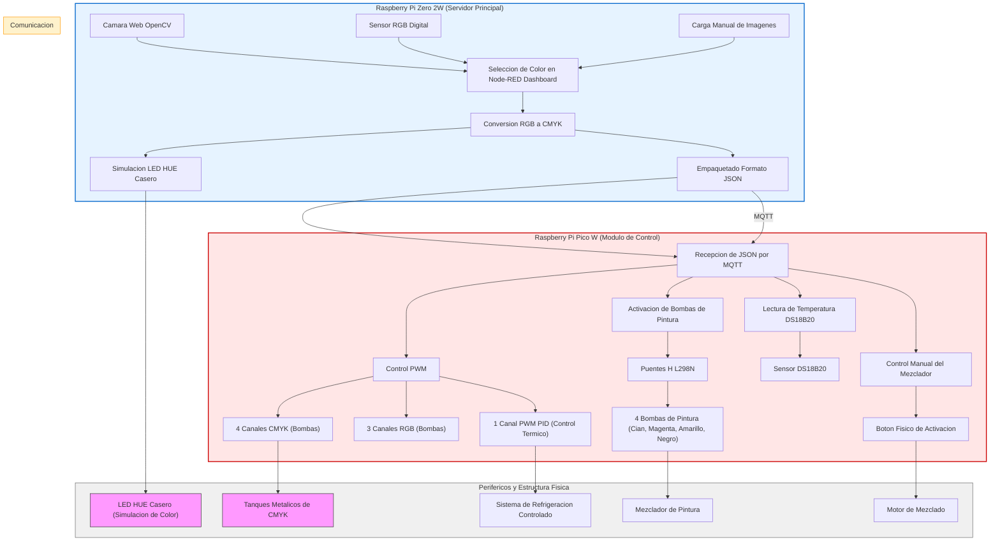

```mermaid
flowchart TD
    %% ================= MAESTRO (Raspberry Pi Zero 2W) =================
    subgraph Maestro["Raspberry Pi Zero 2W (Servidor Principal)"]
        A["Camara Web OpenCV"] --> B["Seleccion de Color en Node-RED Dashboard"]
        C["Sensor RGB Digital"] --> B
        D["Carga Manual de Imagenes"] --> B
        B --> E["Conversion RGB a CMYK"]
        E --> F["Simulacion LED HUE Casero"]
        E --> G["Empaquetado Formato JSON"]
    end

    %% ================= ESCLAVO (Raspberry Pi Pico W) =================
    subgraph Esclavo["Raspberry Pi Pico W (Modulo de Control)"]
        G --> H["Recepcion de JSON por MQTT"]
        H --> I["Control PWM"]
        H --> J["Lectura de Temperatura DS18B20"]
        H --> K["Activacion de Bombas de Pintura"]
        H --> L["Control Manual del Mezclador"]

        %% PWM
        I --> M["4 Canales CMYK (Bombas)"]
        I --> N["3 Canales RGB (Bombas)"]
        I --> O["1 Canal PWM PID (Control Termico)"]

        %% Termico
        J --> P["Sensor DS18B20"]

        %% Bombas
        K --> R["Puentes H L298N"]
        R --> S["4 Bombas de Pintura (Cian, Magenta, Amarillo, Negro)"]

        %% Mezclador
        L --> T["Boton Fisico de Activacion"]
    end

    %% ================= PERIFERICOS =================
    subgraph Perifericos["Perifericos y Estructura Fisica"]
        F --> U["LED HUE Casero (Simulacion de Color)"]
        M --> V["Tanques Metalicos de CMYK"]
        O --> W["Sistema de Refrigeracion Controlado"]
        S --> Y["Mezclador de Pintura"]
        T --> Z["Motor de Mezclado"]
    end

    %% ================= COMUNICACION =================
    subgraph Comunicacion["Comunicacion"]
        G -->|MQTT| H
    end

    %% ================= ESTILOS =================
    style Maestro fill:#e6f3ff,stroke:#0066cc,stroke-width:2px
    style Esclavo fill:#ffe6e6,stroke:#cc0000,stroke-width:2px
    style Perifericos fill:#f0f0f0,stroke:#666,stroke-width:1px
    style Comunicacion fill:#fff2cc,stroke:#ff9900,stroke-width:1px
    style V fill:#f9f,stroke:#333
    style U fill:#f9f,stroke:#333
```
