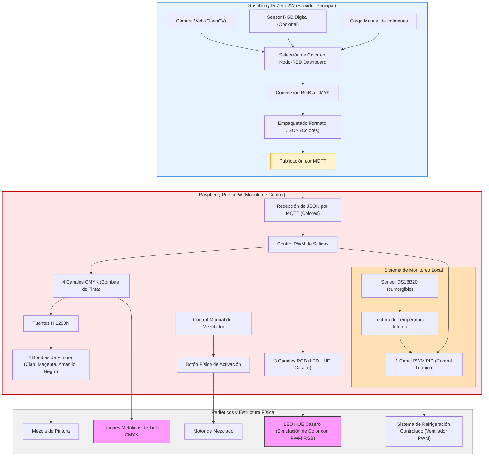

```mermaid
flowchart TD
    %% ================= MAESTRO (Raspberry Pi Zero 2W) =================
    subgraph Maestro["Raspberry Pi Zero 2W (Servidor Principal)"]
        A["Cámara Web (OpenCV)"] --> B["Selección de Color en Node-RED Dashboard"]
        C["Sensor RGB Digital (Opcional)"] --> B
        D["Carga Manual de Imágenes"] --> B
        B --> E["Conversión RGB a CMYK"]
        E --> F["Empaquetado Formato JSON (Colores)"]
        F --> G["Publicación por MQTT"]
    end

    %% ================= ESCLAVO (Raspberry Pi Pico W) =================
    subgraph Esclavo["Raspberry Pi Pico W (Módulo de Control)"]
        G --> H["Recepción de JSON por MQTT (Colores)"]
        H --> I["Control PWM de Salidas"]

        %% PWM
        I --> M["4 Canales CMYK (Bombas de Tinta)"]
        I --> N["3 Canales RGB (LED HUE Casero)"]
        I --> O["1 Canal PWM PID (Control Térmico)"]

        %% Lectura de Temperatura (Local)
        subgraph Temperatura["Sistema de Monitoreo Local"]
            J["Sensor DS18B20 (sumergible)"] --> P["Lectura de Temperatura Interna"]
            P --> O
        end

        %% Bombas
        M --> R["Puentes H L298N"]
        R --> S["4 Bombas de Pintura (Cian, Magenta, Amarillo, Negro)"]

        %% Mezclador
        L["Control Manual del Mezclador"] --> T["Botón Físico de Activación"]
    end

    %% ================= PERIFÉRICOS =================
    subgraph Periféricos["Periféricos y Estructura Física"]
        N --> U["LED HUE Casero (Simulación de Color con PWM RGB)"]
        M --> V["Tanques Metálicos de Tinta CMYK"]
        O --> W["Sistema de Refrigeración Controlado (Ventilador PWM)"]
        S --> Y["Mezcla de Pintura"]
        T --> Z["Motor de Mezclado"]
    end

    %% ================= ESTILOS =================
    style Maestro fill:#e6f3ff,stroke:#0066cc,stroke-width:2px
    style Esclavo fill:#ffe6e6,stroke:#cc0000,stroke-width:2px
    style Temperatura fill:#ffe0b3,stroke:#cc6600,stroke-width:2px
    style Periféricos fill:#f0f0f0,stroke:#666,stroke-width:1px
    style G fill:#fff2cc,stroke:#ff9900,stroke-width:1px
    style V fill:#f9f,stroke:#333
    style U fill:#f9f,stroke:#333
```
