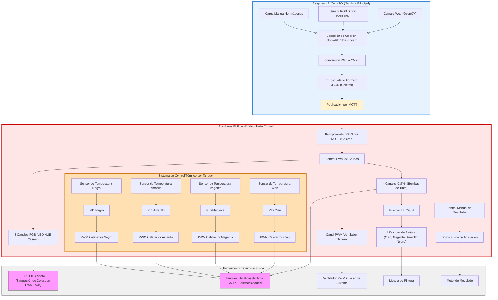

```mermaid
flowchart TD
    %% ================= MAESTRO (Raspberry Pi Zero 2W) =================
    subgraph Maestro["Raspberry Pi Zero 2W (Servidor Principal)"]
        A["Cámara Web (OpenCV)"] --> B["Selección de Color en Node-RED Dashboard"]
        C["Sensor RGB Digital (Opcional)"] --> B
        D["Carga Manual de Imágenes"] --> B
        B --> E["Conversión RGB a CMYK"]
        E --> F["Empaquetado Formato JSON (Colores)"]
        F --> G["Publicación por MQTT"]
    end

    %% ================= ESCLAVO (Raspberry Pi Pico W) =================
    subgraph Esclavo["Raspberry Pi Pico W (Módulo de Control)"]
        G --> H["Recepción de JSON por MQTT (Colores)"]
        H --> I["Control PWM de Salidas"]

        %% PWM
        I --> M["4 Canales CMYK (Bombas de Tinta)"]
        I --> N["3 Canales RGB (LED HUE Casero)"]

        %% Temperatura - Control Independiente
        subgraph Temperatura["Sistema de Control Térmico por Tanque"]
            J1["Sensor de Temperatura Cian"] --> P1["PID Cian"]
            J2["Sensor de Temperatura Magenta"] --> P2["PID Magenta"]
            J3["Sensor de Temperatura Amarillo"] --> P3["PID Amarillo"]
            J4["Sensor de Temperatura Negro"] --> P4["PID Negro"]

            P1 --> T1["PWM Calefactor Cian"]
            P2 --> T2["PWM Calefactor Magenta"]
            P3 --> T3["PWM Calefactor Amarillo"]
            P4 --> T4["PWM Calefactor Negro"]
        end

        %% Bombas
        M --> R["Puentes H L298N"]
        R --> S["4 Bombas de Pintura (Cian, Magenta, Amarillo, Negro)"]

        %% Mezclador
        L["Control Manual del Mezclador"] --> Z["Botón Físico de Activación"]

        %% Ventilador Auxiliar
        I --> O["Canal PWM Ventilador General"]
    end

    %% ================= PERIFÉRICOS =================
    subgraph Periféricos["Periféricos y Estructura Física"]
        N --> U["LED HUE Casero (Simulación de Color con PWM RGB)"]
        M --> V["Tanques Metálicos de Tinta CMYK (Calefaccionados)"]
        T1 --> V
        T2 --> V
        T3 --> V
        T4 --> V
        O --> W["Ventilador PWM Auxiliar de Sistema"]
        S --> Y["Mezcla de Pintura"]
        Z --> X["Motor de Mezclado"]
    end

    %% ================= ESTILOS =================
    style Maestro fill:#e6f3ff,stroke:#0066cc,stroke-width:2px
    style Esclavo fill:#ffe6e6,stroke:#cc0000,stroke-width:2px
    style Temperatura fill:#ffe0b3,stroke:#cc6600,stroke-width:2px
    style Periféricos fill:#f0f0f0,stroke:#666,stroke-width:1px
    style G fill:#fff2cc,stroke:#ff9900,stroke-width:1px
    style V fill:#f9f,stroke:#333
    style U fill:#f9f,stroke:#333
```
