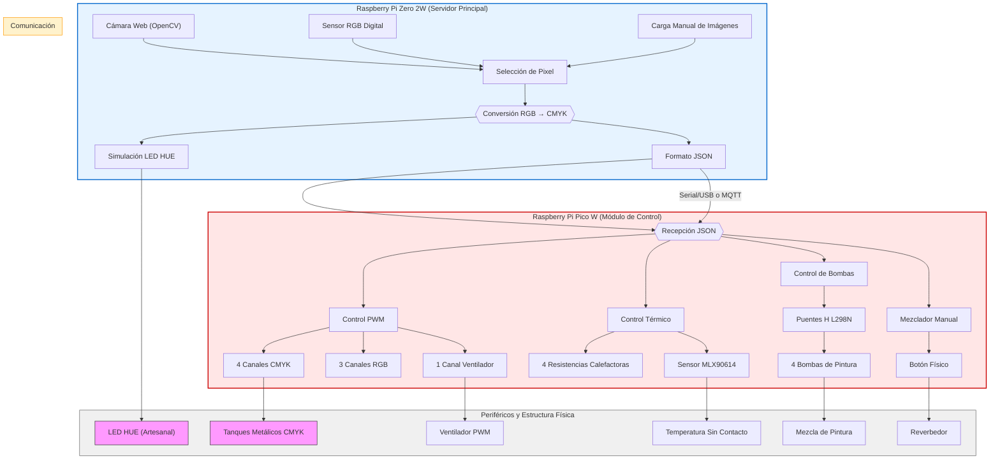

```mermaid
flowchart TD
    %% ================= MAESTRO (Raspberry Pi Zero 2W) =================
    subgraph Maestro["Raspberry Pi Zero 2W (Servidor Principal)"]
        A["Cámara Web (OpenCV)"] --> B[Selección de Pixel]
        C["Sensor RGB Digital"] --> B
        D["Carga Manual de Imágenes"] --> B
        B --> E{{"Conversión RGB → CMYK"}}
        E --> F[Simulación LED HUE]
        E --> G[Formato JSON]
    end

    %% ================= ESCLAVO (Raspberry Pi Pico W) =================
    subgraph Esclavo["Raspberry Pi Pico W (Módulo de Control)"]
        G --> H{{"Recepción JSON"}}
        H --> I[Control PWM]
        H --> J[Control Térmico]
        H --> K[Control de Bombas]
        H --> L[Mezclador Manual]

        %% PWM
        I --> M["4 Canales CMYK"]
        I --> N["3 Canales RGB"]
        I --> O["1 Canal Ventilador"]

        %% Térmico
        J --> P["4 Resistencias Calefactoras"]
        J --> Q["Sensor MLX90614"]

        %% Bombas
        K --> R["Puentes H L298N"]
        R --> S["4 Bombas de Pintura"]

        %% Mezclador
        L --> T["Botón Físico"]
    end

    %% ================= PERIFÉRICOS =================
    subgraph Periféricos["Periféricos y Estructura Física"]
        F --> U["LED HUE (Artesanal)"]
        M --> V["Tanques Metálicos CMYK"]
        O --> W["Ventilador PWM"]
        Q --> X["Temperatura Sin Contacto"]
        S --> Y["Mezcla de Pintura"]
        T --> Z["Reverbedor"]
    end

    %% ================= COMUNICACIÓN =================
    subgraph Comunicación["Comunicación"]
        G -->|Serial/USB o MQTT| H
    end

    %% ================= ESTILOS =================
    style Maestro fill:#e6f3ff,stroke:#0066cc,stroke-width:2px
    style Esclavo fill:#ffe6e6,stroke:#cc0000,stroke-width:2px
    style Periféricos fill:#f0f0f0,stroke:#666,stroke-width:1px
    style Comunicación fill:#fff2cc,stroke:#ff9900,stroke-width:1px
    style V fill:#f9f,stroke:#333
    style U fill:#f9f,stroke:#333
```
